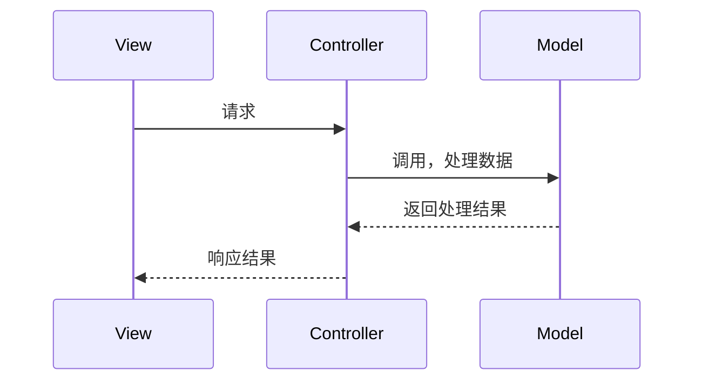
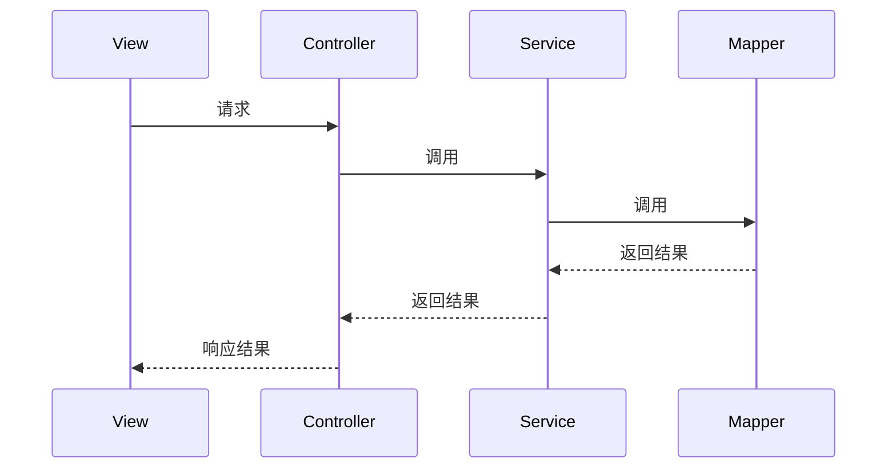
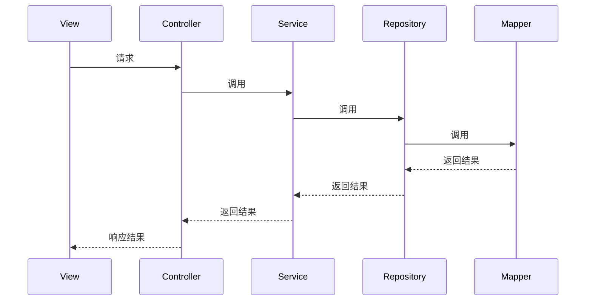
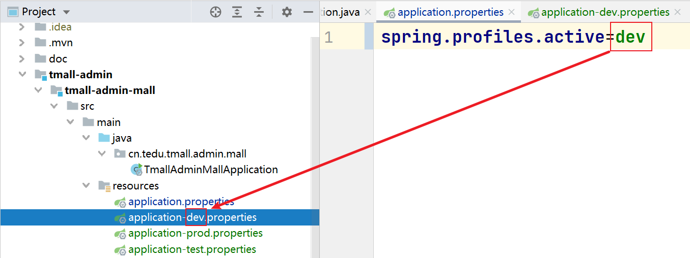

# 9. 关于项目内部的分包

服务器端项目通常采取MVC的设计理念。

> MVC = Model + View + Controller
>
> 目前，服务器端的开发不再关注View的问题，因为将采取前后端分离的开发模式。

其典型的数据处理流程是：



以此前的项目中，具体表现为：



本次要开发的项目中，为了进一步实现解耦，处理流程将调整为：



所以，本次开发的项目中，包结构大致是：

```
根包
-- config：配置类
-- controller：控制器类
-- pojo：POJO类
-- -- entity：实体类：与数据表对应的类
-- -- param：参数类：客户端提交的请求参数的类
-- -- vo：VO类：从数据库中查询出来的结果的类
-- service：业务接口
-- -- impl：业务实现类
-- dao：数据访问对象（Data Access Object），用于访问数据库中的数据
-- -- cache：缓存（中后期再讲）
-- -- persist：持久层，即数据库编程
-- -- -- repository：数据仓库
-- -- -- mapper：使用MyBatis处理数据库编程的相关代码文件
```

# 10. 关于业务功能的开发

首先，你应该分析项目中所涉及的数据类型，例如：收货地址（后台管理中并不是必要的）、商品、订单、订单中的商品、类别、审核日志、评论，然后，你需要对这些数据类型的开发进行排序，应该先开发基础数据，及简单的数据，则以上数据类型的开发顺序可以是：类别 > 商品 > 审核日志 > 收货地址 > 订单 + 订单中的商品 > 评论。

接下来，你应该分析各种数据需要开发哪些对应的业务功能，以类别为例，需要开发的业务功能应该有：新增类别、修改类别、删除类别、是否显示、是否启用、根据父级类别查询子级类别列表、根据ID查询类别详情，然后，你仍需要对这些业务功能进行排序，应该先大致遵循增、查、删、改的顺序，则以上业务功能的开发顺序应该是：新增类别 > 根据父级类别查询子级类别列表 > 根据ID查询类别详情 > 删除类别 > 是否显示 + 是否启用 > 修改类别。

每个业务功能的具体的开发顺序应该是：

1. Mapper及相关的实体类、VO类
2. Repository
3. Service及相关的Param类
4. Controller

综上所述，目前的开发顺序应该是：

1. 新增类别 -- Mapper及相关的实体类、VO类
2. 新增类别 -- Repository
3. 新增类别 -- Service及相关的Param类
4. 新增类别 -- Controller
5. 根据父级类别查询子级类别列表 -- Mapper及相关的实体类、VO类
6. 根据父级类别查询子级类别列表 -- Repository
7. 根据父级类别查询子级类别列表 -- Service及相关的Param类
8. 根据父级类别查询子级类别列表 -- Controller
9. 根据ID查询类别详情 -- Mapper及相关的实体类、VO类
10. 根据父级类别查询子级类别列表 -- Repository
11. 根据父级类别查询子级类别列表 -- Service及相关的Param类
12. 根据父级类别查询子级类别列表 -- Controller
13. …… ……

# 11. 添加依赖

关于数据库编程，需要添加依赖项：

```xml
<mybatis-spring-boot-starter.version>2.2.2</mybatis-spring-boot-starter.version>
<mysql-connector-j.version>8.0.33</mysql-connector-j.version>
```

```xml
<!-- MyBatis整合Spring Boot的依赖项 -->
<dependency>
    <groupId>org.mybatis.spring.boot</groupId>
    <artifactId>mybatis-spring-boot-starter</artifactId>
    <version>${mybatis-spring-boot-starter.version}</version>
</dependency>
<!-- MySQL数据库编程的依赖项 -->
<dependency>
    <groupId>com.mysql</groupId>
    <artifactId>mysql-connector-j</artifactId>
    <scope>runtime</scope>
    <version>${mysql-connector-j.version}</version>
</dependency>
```

当添加以上依赖项后，启动项目时（加载Spring容器时），Spring Boot会自动**读取**连接数据库的相关配置信息，以自动配置`DataSource`，如果没有配置连接数据库的信息，则启动失败！

可以在`application.properties`中添加配置：

```properties
spring.datasource.url=jdbc:mysql://localhost:3306/数据库名字?serverTimezone=Asia/Shanghai&useUnicode=true&characterEncoding=utf-8
spring.datasource.username=root
spring.datasource.password=root
```

至此，可以通过IntelliJ IDEA右侧的Maven面板查看到项目成功的添加了依赖，且项目可以成功启动！

如果需要检验以上配置值是否正确，可以编写测试：

```java
@Autowired
DataSource dataSource;

@Test
void getConnection() throws Throwable {
    dataSource.getConnection();
}
```

# 12. 关于Profile配置

Spring框架支持使用多套配置（Profile配置）文件，并在多套配置文件之间切换选取其中的某一些配置文件并应用。

Spring Boot框架简化了Profile配置的应用，在Spring Boot项目中，`application.properties`是始终会被加载的配置文件，开发者可以按照`application-自定义名称.properties`这样的文件名来创建Profile配置文件，各Profile配置文件默认是不会被读取的，需要在`application.properties`中配置`spring.profiles.active`属性才可以激活某些Profile配置，此属性的值就是Profile配置文件的文件名中自定义的部分。



在同一个项目中，允许同时激活多个Profile配置，例如：

```properties
# 需要激活 application-dev-tom.properties 和 application-dev-frank.properties
spring.profiles.active=dev-tom, dev-frank
```

如果同时激活的多个配置中，存在相同的属性，但值不同，根据以上配置值中偏后的文件中的配置为准。

如果在`application.properties`和某个Profile配置中，存在相同的属性，但值不同，将以Profile配置中的配置为准。

# 13. 关于YAML配置

YAML是一种编写配置文件的语法，表现为以`.yml`或`.yaml`为扩展名的文件。

相比`.properties`配置文件，使用YAML语法，有以下区别：

- 属性名与属性值之间使用1个冒号和1个空格进行分隔
- 属性名中以小数点分隔的多个部分，改为1个冒号加换行，且换行后缩进2个空格
  - 非必要，但推荐
- 多个属性中，相同的部分不必重复配置，只需要在属性名不同的部分位置保持相同的缩进即可

例如：

```properties
spring.datasource.url=jdbc:mysql://localhost:3306/baking
spring.datasource.username=root
spring.datasource.password=root
```

调整为YAML语法应该是：

```yaml
spring:
  datasource:
    url: jdbc:mysql://localhost:3306/baking
    username: root
    password: root
```

提示：在YAML配置中，如果某个属性的值为空，使用 `~` 表示。

注意：Spring框架并不直接识别YAML格式的配置文件，需要额外添加`snakeyaml`依赖项，在Spring Boot的基础依赖项（`spring-boot-starter`）中已经包含此依赖，所以，在Spring Boot项目中可以直接使用YAML配置文件！

在Spring Boot项目中，你可以根据个人需求或喜好选择使用`.properties`配置或YAML配置，并且，也都支持Profile配置。

# 14. 创建数据库与数据表

创建名为`tedu_tea_store`的数据库：

```mysql
CREATE DATABASE tedu_tea_mall;
```

然后，在IntelliJ IDEA中配置Database面板，连接到以上创建的数据库。

从老师共享的项目中找到创建数据库的`.sql`脚本，点击鼠标右键，选择`Run 脚本文件名`，并在弹出的对话框中选择数据库，执行即可。

# 新增类别 -- Mapper及相关的实体类、VO类

在本项目中，数据库编程将使用MyBatis Plus框架。

MyBatis Plus是基于MyBatis的无侵入性的框架，内置完成许多基础的CRUD。

在使用时，需要添加依赖：

```xml
<mybatis-plus-spring-boot.version>3.3.0</mybatis-plus-spring-boot.version>
```

```xml
<!-- Mybatis Plus整合Spring Boot的依赖项 -->
<dependency>
    <groupId>com.baomidou</groupId>
    <artifactId>mybatis-plus-boot-starter</artifactId>
    <version>${mybatis-plus-spring-boot.version}</version>
</dependency>
```

在实现插入类别数据时，需要：

- 创建实体类

  - 【MyBaits Plus】在实体类上添加`@TableName`注解，配置所对应的数据表名称
  - 【MyBaits Plus】如果你确定当前数据表的主键是自动编号的，需要在实体类中与主键对应的属性上配置`@TableId(type = IdType.AUTO)`

- 创建Mapper接口

  - 【MyBaits Plus】使得自定义的Mapper继承自MyBatis Plus的`BaseMapper`接口，并且，继承时指定的泛型为实体类

- 通过配置类中的`@MapperScan`指定Mapper接口所在的包

  


