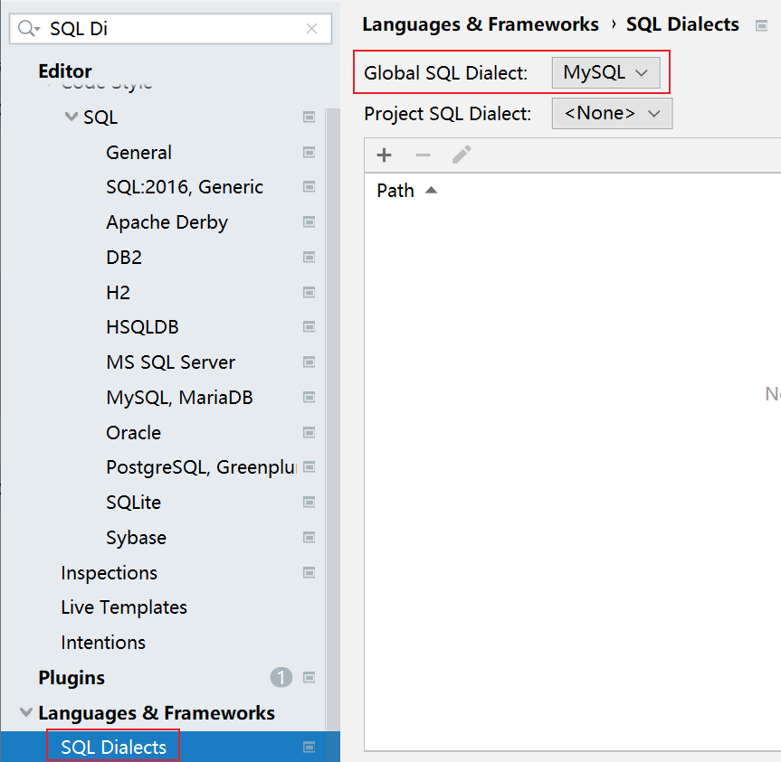

# 16. 关于MyBatis Plus（续）

关于简单的数据访问的演示：

```java
@SpringBootTest
public class CategoryMapperTests {

    @Autowired
    CategoryMapper mapper;

    @Test
    void insert() {
        Category category = new Category();
        category.setName("大红袍2");

        int rows = mapper.insert(category);
        System.out.println("插入数据完成，受影响的行数：" + rows);
    }

    @Test
    void deleteById() {
        Long id = 1L;

        int rows = mapper.deleteById(id);
        System.out.println("删除数据完成，受影响的行数：" + rows);
    }

    @Test
    void deleteByMap() {
        // 使用deleteByMap的不足：无法处理逻辑关联，并且，只能是“等于”
        Map<String, Object> map = new HashMap<>();
        map.put("id", 6);
        map.put("name", "Test7");

        int rows = mapper.deleteByMap(map);
        System.out.println("删除数据完成，受影响的行数：" + rows);
    }

    @Test
    void delete() {
        QueryWrapper<Category> wrapper = new QueryWrapper<>();
        // wrapper.eq("id", 6); // equals
        // wrapper.ne("id", 8); // not equals
        // wrapper.gt("id", 8); // greater than
        wrapper.lt("id", 14); // less than

        int rows = mapper.delete(wrapper);
        System.out.println("删除数据完成，受影响的行数：" + rows);
    }

    @Test
    void deleteBatchIds() {
        List<Long> idList = new ArrayList<>();
        idList.add(1L);
        idList.add(3L);
        idList.add(5L);
        idList.add(7L);
        idList.add(9L);

        int rows = mapper.deleteBatchIds(idList);
        System.out.println("删除数据完成，受影响的行数：" + rows);
    }

    @Test
    void updateById() {
        Category category = new Category();
        category.setId(4L);
        category.setName("大红袍4");

        int rows = mapper.updateById(category);
        System.out.println("修改数据完成，受影响的行数：" + rows);
    }

    @Test
    void selectCount() {
        int count = mapper.selectCount(null); // select count(*) from xxx;
        System.out.println("统计数据完成，数据量：" + count);
    }

}
```

当在项目中应用了MyBaits Plus，可以不必再写简单的数据访问功能，但，仍有一些功能可能需要自行开发：

- 批量插入
- 除了统计以外的查询功能

关于自定义的数据访问功能，例如“根据ID查询类别详情”，则应该：

- 自定义VO类
- 在接口中声明抽象方法
- 使用XML配置SQL语句
- 指定XML文件的位置
  - 首次使用时需要
  - 如果文件夹名称是`mapper`，则不需要配置，如果不是，需要配置`mybatis-plus.mapper-locations`属性，取值可参考MyBatis的配置

附：配置SQL方言，则在XML中编写SQL时可以获得表名、字段列表等提示



另外，MyBaits Plus还可以辅助处理自动插入时间字段的值！你需要：

- 自定义组件类，实现`MetaObjectHandler`接口，并重写其中的某些方法，指定自动插入时间的属性与值
- 在实体类上，对于需要自动处理值的属性，配置注解

关于自定义的`MetaObjectHandler`代码示例：

```java
/**
 * 基于MyBatis Plus的自动填充时间的处理器类
 *
 * @author java@tedu.cn
 * @version 2.0
 */
@Slf4j
@Component
public class TimeMetaObjectHandler implements MetaObjectHandler {

    /**
     * 数据创建时间的属性名
     */
    public static final String FIELD_CREATE_TIME = "gmtCreate";
    /**
     * 数据最后修改时间的属性名
     */
    public static final String FIELD_UPDATE_TIME = "gmtModified";

    public TimeMetaObjectHandler() {
        log.info("创建MyBatis Plus的自动填充数据的处理器对象：TimeMetaObjectHandler");
    }

    @Override
    public void insertFill(MetaObject metaObject) {
        LocalDateTime now = LocalDateTime.now();
        this.setFieldValByName(FIELD_CREATE_TIME, now, metaObject);
        this.setFieldValByName(FIELD_UPDATE_TIME, now, metaObject);
    }

    @Override
    public void updateFill(MetaObject metaObject) {
        LocalDateTime now = LocalDateTime.now();
        this.setFieldValByName(FIELD_UPDATE_TIME, now, metaObject);
    }

}
```

实体类代码片段示例：

```java
@Data
@TableName("mall_category")
public class Category implements Serializable {

    // 忽略不需要关心的代码

    /**
     * 数据创建时间
     */
    @TableField(fill = FieldFill.INSERT) // 本次重点
    private LocalDateTime gmtCreate;

    /**
     * 数据最后修改时间
     */
    @TableField(fill = FieldFill.INSERT_UPDATE) // 本次重点
    private LocalDateTime gmtModified;

}
```

# 17. 新增类别 -- Repository

在项目中添加Repository组件，它将是Mapper的调用者，且，被Service调用，它的价值在于解除Service对Mapper的依赖，以至于当Mapper发生变化（甚至更换了数据库编程技术）后，Service不需要做任何调整！因为Service是用于体现数据处理的规则的，而编程技术的变化不应该导致数据规则的变化！

关于Repository层代码的编写，应该是：

- 先定义Repository接口，例如`ICategoryRepository`
- 再定义Repository实现类，例如`CategoryRepositoryImpl`
  - 具体功能的实现，基本上都是直接调用Mapper已有的方法即可

# 18. 新增类别 -- Service

Service在项目中的价值在于：设计业务流程、业务逻辑，以保证数据的完整性、有效性、安全性。

关于Service层代码的编写，应该是：

- 按需定义参数类
- 先定义Service接口，例如`ICategoryService`
- 再定义Service实现类，例如`CategoryServiceImpl`


