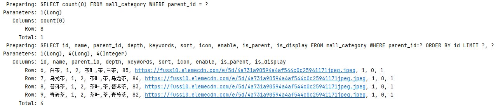
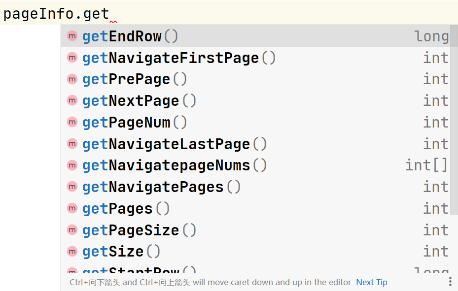

# 21. 使用PageHelper框架处理分页查询

执行分页查询的SQL语句大致是：

```mysql
select 字段列表 from 表名 [where子句] [order by子句] limit 偏移数,取出的数据量;
```

在开发实践中，如果只执行以上分页查询，则功能是不完整的，因为分页结果响应到客户端的同时，服务器端还应该向客户端响应分页的其它数据，例如数据总量、最大页码值等，才便于客户端显示分页数据！

如果需要得到数据总量、最大页码，可以通过统计查询得到：

```mysql
select count(*) from 表名 [where子句];
```

PageHelper是一款专用于MyBatis的无侵入性的分页查询框架。

> PageHelper是通过MyBatis拦截器实现的。

关于PageHelper的依赖项：

```xml
<pagehelper-spring-boot.version>1.3.0</pagehelper-spring-boot.version>
```

```xml
<!-- 基于MyBatis或MyBatis Plus的分页查询框架 -->
<dependency>
    <groupId>com.github.pagehelper</groupId>
    <artifactId>pagehelper-spring-boot-starter</artifactId>
    <version>${pagehelper-spring-boot.version}</version>
</dependency>
```

使用PageHelper框架处理分页时，只需要在原本的Mapper查询之前配置分页参数即可，例如：

```java
Long parentId = 1L;
PageHelper.startPage(2, 4); // 配置分页参数
List<?> list = mapper.listByParent(parentId);
```

**注意：**请确保配置分页参数的语句，与调用Mapper查询的语句，是2条连续的语句，PageHelper框架会通过ThreadLocal来保证线程安全，否则，可能导致线程安全问题。

PageHelper会通过MyBatis拦截器对原SQL语句进行拦截，添加执行对应的统计查询，并将原SQL语句进行修改，添加`limit`子句，以实现分页查询：



并且，查询的返回结果将是`com.github.pagehelper.Page`类型的，此类型继承自`ArrayList`，但其中包含了分页相关的数据，例如数据总量、最大页码值等。

由于通常查询列表的Mapper方法的返回值会声明为`List`类型，除非向下转型，否则无法调用`Page`类型中的方法来获取数据总量、最大页码值等数据，PageHelper还提供了`PageInfo`类，只需要将`List`对象作为构造方法的参数传入即可，`PageInfo`提供了相关的API可以获取分页相关参数：

```java
PageInfo<?> pageInfo = new PageInfo<>(list);
```



在开发实践中，为了避免PageHelper侵入到Service、Controller，则可以自定义数据类型，用于存放查询的数据列表、数据总量、最大页码值等数据，例如：

```java
package cn.tedu.tmall.common.pojo.vo;

import lombok.Data;
import lombok.experimental.Accessors;

import java.io.Serializable;
import java.util.List;

/**
 * 分页数据类
 *
 * @author java@tedu.cn
 * @version 2.0
 */
@Data
@Accessors(chain = true)
public class PageData<T> implements Serializable {

    /**
     * 每页记录数
     */
    private Integer pageSize;

    /**
     * 记录总数
     */
    private Long total;

    /**
     * 当前页码
     */
    private Integer currentPage;

    /**
     * 最大页码
     */
    private Integer maxPage;

    /**
     * 数据列表
     */
    private List<T> list;

}
```

另外，为了便于实现将`PageInfo`的数据填充到自定义的`PageData`中，还可以创建转换的工具类：

```java
package cn.tedu.tmall.common.util;

import cn.tedu.tmall.common.pojo.vo.PageData;
import com.github.pagehelper.PageInfo;

/**
 * 将PageInfo转换成PageData的转换器工具类
 *
 * @author java@tedu.cn
 * @version 2.0
 */
public class PageInfoToPageDataConverter {

    /**
     * 将PageHelper框架中的PageInfo类型对象转换成自定义的PageData类型对象
     *
     * @param pageInfo PageInfo对象
     * @param <T>      PageInfo对象中的列表数据中的元素数据的类型
     * @return 自定义的PageData类型的对象
     */
    public synchronized static <T> PageData<T> convert(PageInfo<T> pageInfo) {
        PageData<T> pageData = new PageData<>();
        pageData.setPageSize(pageInfo.getPageSize())
                .setTotal(pageInfo.getTotal())
                .setCurrentPage(pageInfo.getPageNum())
                .setMaxPage(pageInfo.getPages())
                .setList(pageInfo.getList());
        return pageData;
    }

}
```

则以后只需要通过工具中的方法，就可以轻松进行转换，例如：

```java
PageData<?> pageData = PageInfoToPageDataConverter.convert(pageInfo);
```

# 22. 根据父级类别查询子级类别列表 -- Repository

接口中的抽象方法：

```java
PageData<CategoryListItemVO> listByParent(Long parentId, Integer pageNum, Integer pageSize);
```

实现以上方法：

```java
@Override
public PageData<CategoryListItemVO> listByParent(Long parentId, Integer pageNum, Integer pageSize) {
    PageHelper.startPage(pageNum, pageSize);
    List<CategoryListItemVO> list = categoryMapper.listByParent(parentId);
    PageInfo<CategoryListItemVO> pageInfo = new PageInfo(list);
    return PageInfoToPageDataConverter.convert(pageInfo);
}
```

测试：

```java
@Test
void listByParent() {
    Long parentId = 1L;
    Integer pageNum = 1;
    Integer pageSize = 3;
    PageData<?> pageData = repository.listByParent(parentId, pageNum, pageSize);
    System.out.println("查询列表完成！");
    System.out.println("数据总量：" + pageData.getTotal());
    System.out.println("当前页码：" + pageData.getCurrentPage());
    System.out.println("每页数据量：" + pageData.getPageSize());
    System.out.println("最大页码：" + pageData.getMaxPage());
    List<?> list = pageData.getList();
    System.out.println("本次查询结果的列表中的数据量：" + list.size());
    for (Object item : list) {
        System.out.println(item);
    }
}
```

# 23. 根据父级类别查询子级类别列表 -- Service

在`application-dev.yaml`中添加配置：

```yaml
tmall:
  dao:
    default-query-page-size: 20
```

在接口中添加抽象方法：

```java
PageData<CategoryListItemVO> listByParent(Long parentId, Integer pageNum);

PageData<CategoryListItemVO> listByParent(Long parentId, Integer pageNum, Integer pageSize);
```

实现以上方法：

```java
@Value("${tmall.dao.default-query-page-size}")
private Integer defaultQueryPageSize;

@Override
public PageData<CategoryListItemVO> listByParent(Long parentId, Integer pageNum) {
    return categoryRepository.listByParent(parentId, pageNum, defaultQueryPageSize);
}

@Override
public PageData<CategoryListItemVO> listByParent(Long parentId, Integer pageNum, Integer pageSize) {
    return categoryRepository.listByParent(parentId, pageNum, pageSize);
}
```

# 24. 根据父级类别查询子级类别列表 -- Controller

```java
@ApiOperation("根据父级查询子级列表")
@ApiOperationSupport(order = 420)
@ApiImplicitParams({
        @ApiImplicitParam(name = "parentId", value = "父级类别ID", dataType = "long", required = true),
        @ApiImplicitParam(name = "page", value = "页码", dataType = "int")
})
@GetMapping("/list-by-parent")
public JsonResult listByParent(Long parentId, Integer page) {
    Integer pageNum = page;
    if (page == null || page < 1) {
        pageNum = 1;
    }
    PageData<CategoryListItemVO> list
            = categoryService.listByParent(parentId, pageNum);
    return JsonResult.ok(list);
}
```

