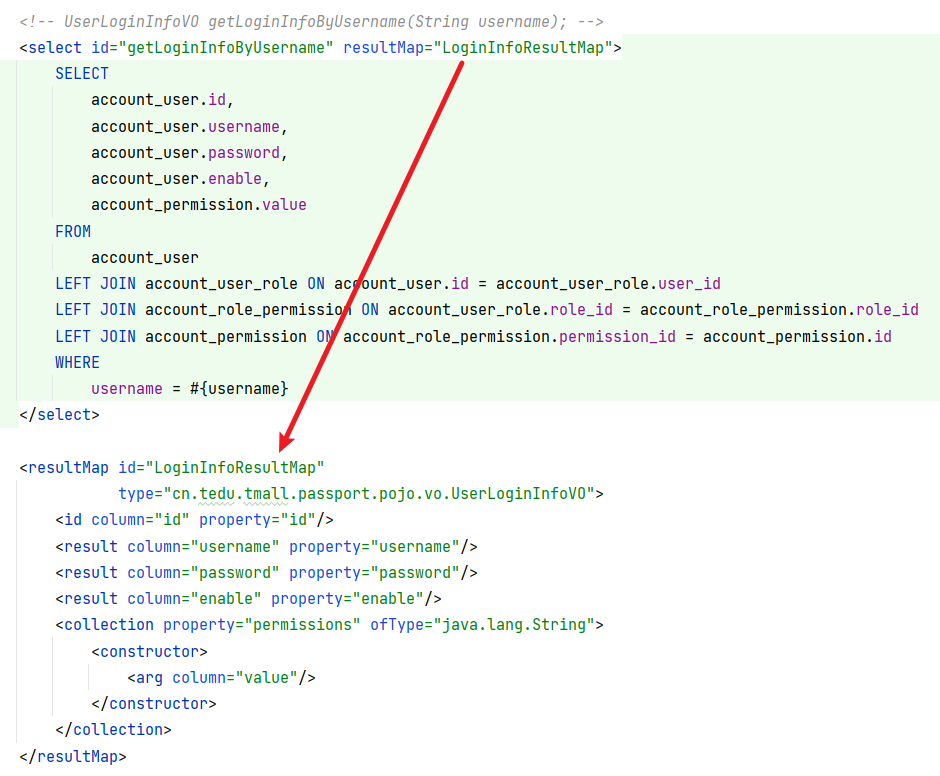

# 关于认证

认证：识别来访的客户端的身份。

请注意：认证与验证登录并不能划等号！严格来讲，验证登录只是认证的一部分，是识别客户端身份的前提条件！

早期的认证实现方案：当验证登录通过后，服务器端会将此用户的相关信息存储到Session（服务器的内存中的数据，每个客户端都有一个唯一对应的Session数据）中，当此客户端下次来访时，可以直接从Session中读取对应的数据，从而识别客户端的身份！

# 关于Spring Security

Spring Security框架的主要作用：处理认证与授权。

在基于Spring Boot的项目中，使用Spring Security需要添加`spring-boot-starter-security`依赖项。

当添加以上依赖项后，由于此依赖项包含一些自动配置，你的项目会发生以下变化：

- 提供默认的登录页面（`/login`）和退出登录页面（`/logout`）
- 默认的用户名是`user`，默认的密码会在启动项目时显示在控制台，是一个UUID值
- 所有请求默认都是需要通过认证的
- 默认开启防止伪造跨域攻击的防御机制，表现为除了登录以外的、未经处理的POST请求都是不可访问的

则需要在项目中添加配置类，进行自定义配置：

```java
@Configuration
public class SecurityConfiguration extends WebSecurityConfigurerAdapter {

    @Override
    protected void configure(HttpSecurity http) throws Exception {
        // 关闭“防止伪造跨域攻击的防御机制”
        http.csrf().disable();

        // 白名单，使用AntStyle模式
        // 使用1个星号，通配某个层级下的任意名称或资源，例如：/admin/* 可以通配：/admin/list或/admin/add-new，但不可以匹配到：/admin/9527/delete
        // 使用2个星号，通配若干层级下的任意名称或资源，例如：/admin/** 可以通配：/admin/list或/admin/add-new，也可以匹配到：/admin/9527/delete
        String[] urls = {
                "/doc.html",
                "/**/*.css",
                "/**/*.js",
                "/swagger-resources",
                "/v2/api-docs",
                "/passport/login",
        };

        // 配置请求授权：采用第一匹配原则
        http.authorizeRequests() // 开始配置请求授权
                .mvcMatchers(urls) // 匹配某些请求
                .permitAll() // 直接许可，即：不需要通过认证
                .anyRequest() // 任意请求（所有请求），表现为：除了以上配置的以外的所有请求
                .authenticated(); // 已经通过认证的

        // 调用formLogin()方法，表示启用登录表单页，不调用则不启用
        // 当未通过认证，却尝试访问需要认证的资源时：
        // -- 如果启用了登录表单页，则自动重定向到登录表单页
        // -- 如果未启用登录表单页，则响应403
        // http.formLogin();
    }

}
```

# 使用Spring Security处理认证

Spring Security框架执行认证的唯一做法就是：从`SecurityContext`中取出认证信息（`Authentication`）。

为了实现通过Spring Security处理认证，则需要：当验证登录通过后，将认证信息（`Authentication`）存入到`SecurityContext`中，后续，当Spring Security尝试处理认证时，才可以取出认证信息。

创建认证信息时，应该向认证信息中存入“当事人”数据，Spring Security框架并没有约束当事人的数据类型，则可以按需自定义数据类型作为当事人，通常，当事人数据中至少包括用户ID、用户名，则可以在`tmall-common`中创建自定义的当事人类型：

```java
@Data
public class CurrentPrincipal implements Serializable {

    /**
     * 当事人ID
     */
    private Long id;

    /**
     * 当事人用户名
     */
    private String username;

}
```

然后，当验证登录通过后，创建以上类型的当事人，并用于创建认证信息，最后，将认证信息存入到`SecurityContext`中：


后续，当需要识别当事人时，在控制器中：

```java
@GetMapping("/principal")
@ApiOperation("识别当事人")
@ApiOperationSupport(order = 120)
public String principal(@ApiIgnore @AuthenticationPrincipal CurrentPrincipal principal) {
    return "成功处理请求：需要通过认证，且识别当事人：" + principal;
}
```

# 使用Spring Security处理授权

Spring Security会从`SecurityContext`中的认证信息（`Authentication`）中找到权限列表，并用于判断来访的客户端的权限！

如果需要检查来访的客户端是否具有权限执行访问，则需要事先对请求配置权限，配置权限的做法可以是：

- 在Spring Security的配置类中，配置请求权限时直接指定各请求所需的权限：

- 先在Spring Security的配置类上开启“基于方法的访问控制”，例如：

  

  然后，在Controller的方法之前添加注解来配置权限，例如：

  

由于没有对应的权限时Spring Security框架会抛出`AccessDeniedException`异常，所以，需要在全局异常处理器中添加处理此异常的方法：

```java
@ExceptionHandler
public JsonResult handleAccessDeniedException(AccessDeniedException e) {
    String message = "操作失败，您当前登录的账号无此操作权限！";
    return JsonResult.fail(ServiceCode.ERROR_FORBIDDEN, message);
}
```

# 关于密码加密

密码加密的作用：防止数据库被泄密后导致账号安全问题。

关于密码：

- 明文：原始密码
- 密文：经过算法处理后的一个字符串

所以，加密就是通过某种算法将原文进行一系列运算，得到密文的过程。

关于算法的种类：

- 加密算法：不可以用于对密码进行加密并存储的过程，所有加密算法都是可以被逆向运算的
- 单向哈希算法：可以用于对密码进行加密并存储的过程，典型的单向哈希算法有：MD系列、SHA家族、BCrypt、SCrypt等

**注意：**所有单向哈希算法都不可以通过逆向运算根据密文得到原文！

对于单向哈希算法的加密结果，常见的破解手段就是暴力破解，甚至，事先准备明文与密文的对应关系的数据库，当尝试“破解”时，直接从数据库中查询即可！

为了避免密码被以上方式“破解”，可以：

- 要求用户使用安全强度更高的原始密码
- 加盐
- 循环加密：将密文作为原文再次运算
- 使用位数更高的算法：增加了明文密文对应关系的数据库的存储成本
  - 128位算法：MD2 / MD4 / MD5【不建议使用】
  - 160位算法：SHA-1【不建议使用】
  - 256位算法：SHA-258
  - 384位算法：SHA-384
  - 512位算法：SHA-512

- 综合使用以上做法

即便使用以上所有做法，也不一定能解决暴力破解的问题，特别是密码长度受限的应用场景，例如银行卡密码！

为了彻底解决以上问题，强烈推荐使用BCrypt或SCrypt算法！这些算法默认就使用了随机的盐，并且是运算效率极低的算法，甚至你可以调整算法的强度，使之运算过程更慢，以防止被暴力破解！相比之下，SCrypt算法比BCrypt算法更加安全，但是，通常可能没有这个必要！

# 关于使用数据库的权限数据

首先，在验证登录时，查询用户信息时就需要查出对应的权限，需要执行的SQL语句大致：

```mysql
SELECT
    account_user.id,
    account_user.username,
    account_user.password,
    account_user.enable,
    account_permission.value
FROM
    account_user
LEFT JOIN account_user_role ON account_user.id = account_user_role.user_id
LEFT JOIN account_role_permission ON account_user_role.role_id = account_role_permission.role_id
LEFT JOIN account_permission ON account_role_permission.permission_id = account_permission.id
WHERE
    username = 'root';
```

在封装查询结果的VO类，需要添加新的属性，用于封装“权限列表”：


并且，在Mapper层处理查询时，需要配置`<resultMap>`以指导MyBatis封装查询结果：



然后，在验证登录通过后，可以将查询到的权限列表用于创建`Authentication`：


至此，每个用户成功登录后，在`SecurityContext`中都有此用户对应的权限列表，可以使用`@PreAuthorize`注解检查用户是否具有权限执行某些操作。

# 关于伪造跨域攻击

目前，主流的浏览器都是多选项卡的！当你在某个选项卡中打开的网站上登录后，在此浏览器的其它选项卡打开同一个网站，也能通过认证！

假设，当你在第1个选项卡中登录了某个网上银行，在同一个浏览器的第2个选项卡再次打开网上银行的网站，不是需要再登录的，但是，如果你在同一个浏览器的其它选项卡中打开了某个恶意的网站，这个恶意的网站中隐藏了某个会自动发生的请求，此请求会发到你的网上银行去执行转账行为，当网上银行收到此请求后，也会视为“已经通过认证”的请求，则会出现安全问题！

当然，目前的各大网上银行并不会在收到请求时就执行转账行为，而是有更多的安全措施，例如需要再次输入密码，甚至其它验证机制，所以，这种攻击行为可能并不会导致资金类的安全问题，但仍可能导致数据泄密或其它安全问题。

为了解决此问题，Spring Security要求所有POST请求都必须在表单或请求头中携带一个事先下发的UUID值，如果提交请求时也提交了正确的UUID值，则视为正常的请求，否则，将会视为伪造的跨域攻击，会响应`403`。

# 关于UUID

UUID的表现特征为：是一串由128位算法生成的结果，是不可被穷举遍历的，并且，随机、唯一。

> 128位算法：某种算法生成的结果是一个128位的数（128个二进制位），有340282366920938463463374607431768211456种。

UUID的原则是：在同一时空是唯一的。

> 【百科资料】UUID是指在一台机器上生成的数字，它保证对在同一时空中的所有机器都是唯一的。通常平台会提供生成的API。按照开放软件基金会(OSF)制定的标准计算，用到了以太网卡地址、纳秒级时间、芯片ID码和随机数。

