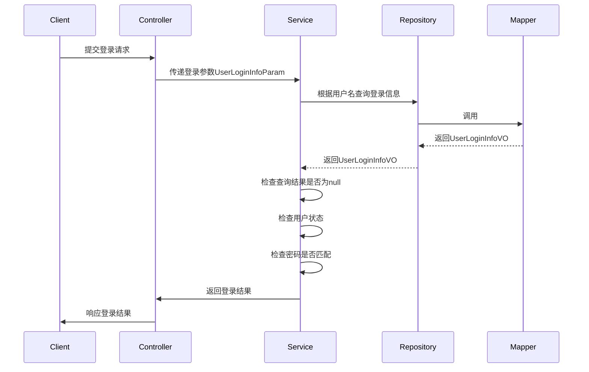

# 使用Redis完善基于JWT的单点登录

## 处理权限列表的分析

**问题：**权限列表应该在哪里？

**解决方案：**

- 由于Spring Security会从`SecurityContext`获取认证信息，所以，权限列表应该作为认证信息的一部分，存入到`SecurityContext`中，在基于JWT的单点登录中，这个行为应该发生在解析JWT时

**问题：**权限列表的数据从哪里来？

**解决方案：**

- 【不推荐】验证登录通过后，生成JWT时，将权限列表写入到JWT中，后续，解析JWT时即可得到权限列表
  - 缺陷：会导致JWT数据很长，且权限列表数据可以视为敏感数据，不应该存入到JWT中
- 【不推荐】JWT中不存储权限列表，只需要存储用户的id、用户名即可，解析JWT后，根据用户id或用户名从数据库中查询出权限列表
  - 缺陷：客户端提交的许多请求均会携带JWT，则都需要解析JWT，所以，解析JWT是高频率的操作，而查询数据库的效率非常低下，这种做法会严重影响性能，也会增加数据库的负担，严重影响数据库的可用性和可靠性
- 【推荐】JWT中不存储权限列表，只需要存储用户的id、用户名即可，并且，把权限列表存入到Redis中，后续，解析JWT后，根据用户id或用户名从Redis中查询出权限列表

**问题：**在Redis中，权限列表应该使用什么数据类型？

**解决方案：**

- 如果权限列表不需要修改，可以使用Redis中的`string`类型，如果需要修改，可以使用Redis中的其它数据类型，例如`set`或`hash`等
  - 说明：本课中，为了简化用法，暂时使用`string`，这会导致用户的权限发生变化后，不便于修改Redis中的数据，此问题暂不解决

**问题：**如何将Java中的`List<GrantedAuthority>`转换成Redis中的`string`类型

**解决方案：**

- 将`List<GrantedAuthority>`转换为JSON格式的字符串，本质上就已经变成Java中的`String`类型了，后续，再将`String`转换回`List<GrantedAuthority>`即可，有许多工具包都可以实现对象与JSON格式的字符串的相互转换，例如：`jackson` / `fastjson` / `gson` / ……
  - 说明：在本课中，将使用`fastjson`

**问题：**哪些用户数据是需要写入到Redis中的，用Redis中的哪种数据类型

**解决方案：**

- 权限列表，因为它不适合使用其它解决文案
- 用户账号的状态（`enable`），保证管理员禁用了某个账号后，能即时使得此账号不可再访问
  - 每次解析JWT时，也会从Redis中检查用户账号的状态，如果无此数据，或状态值异常，则视为“未通过认证”
  - 管理员禁用账号后，直接将此账号在Redis中的数据删除
- 为了便于修改用户账号的状态数据，在Redis中应该使用`hash`类型

## 实现步骤

首先，在`tmall-common`中创建`UserStatePO`类：

```java
@Data
public class UserStatePO implements Serializable {

    /**
     * 账号的启用状态：1=启用，0=禁用
     */
    private Integer enable;

    /**
     * 账号的权限列表
     */
    private String authoritiesJsonString;

}
```

然后，在`tmall-passport`的根包下创建`dao.cache.IUserCacheRepository`接口，并声明读写数据的方法：

```java
public interface IUserCacheRepository {

    // 向缓存中写入用户状态信息
    void saveUserState(Long id, UserStatePO userStatePO);

    // 从缓存中读取用户状态信息
    UserStatePO getUserState(Long id);

}
```

并在根包下创建`dao.cache.impl.UserCacheRepositoryImpl`类，实现以上接口：

```java
@Repository
public class UserCacheRepositoryImpl implements IUserCacheRepository {

    @Autowired
    private RedisTemplate<String, Serializable> redisTemplate;

    @Override
    public void saveUserState(Long id, UserStatePO userStatePO) {
        String key = "passport:user-state:" + id;
        Map<String, Object> map = BeanUtil.beanToMap(userStatePO);
        HashOperations<String, Object, Object> opsForHash = redisTemplate.opsForHash();
        opsForHash.putAll(key, map);
    }

    @Override
    public UserStatePO getUserState(Long id) {
        String key = "passport:user-state:" + id;
        HashOperations<String, Object, Object> opsForHash = redisTemplate.opsForHash();
        Map<Object, Object> entries = opsForHash.entries(key);
        UserStatePO userStatePO = null;
        if (entries.size() > 0) {
            userStatePO = BeanUtil.mapToBean(entries, UserStatePO.class, true, null);
        }
        return userStatePO;
    }

}
```


## 流程相关问题

**问题：**你是怎么实现登录验证的？



**问题：**你是怎么实现单点登录的？

**参考答案：**

- 在验证登录时，如果视为登录成功，将权限列表与用户的账号状态存入到Redis中，并将用户ID、用户名生成为JWT，并响应到客户端
- 后续，客户端提交需要认证的请求时，应该携带JWT向服务器端发起请求
- 在服务器端使用过滤器（`Filter`）处理客户端携带的JWT，此过滤器主要实现：尝试接收JWT，尝试解析JWT，将用户数据创建为`Authentication`并存入到`SecurityContext`中，在具体的处理过程中，如果客户端没有携带JWT，将放行，会由后续的过滤器处理此请求，如果解析JWT失败，将直接响应错误，如果解析JWT成功，则可以得到用户ID与用户名，会检查Redis中的用户账号状态，也会从Redis中获取用户的权限列表，并创建`Authentication`存入到`SecurityContext`中


