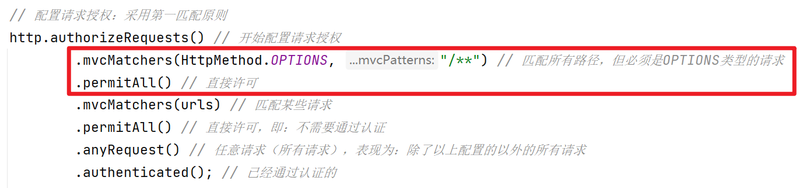

# 关于复杂请求的跨域访问

复杂请求：当客户端提交请求时，如果请求头中配置了某些特殊的字段（例如`Authorization`），则这个请求会被视为复杂请求。

对于复杂请求，客户端（例如浏览器）在发起请求之前，会自动事先向请求的URL发起一个`OPTIONS`类型的请求，以执行预检（PreFlight），如果此请求被服务器端放行，则会正常发起原本的请求，如果此请求被服务器端拒绝，则不会发起原本的请求，并提示错误！

Spring Security默认并不允许客户端提交复杂请求，如果需要允许客户端提交复杂请求，可以：在Spring Security的配置类中的`void configure(HttpSecurity http)`方法中：

- 调用`http.cors()`，则会启用Spring Security自带的`CorsFilter`，此过滤器将会对`OPTIONS`类型的请求放行

- 在配置请求授权时，对`OPTIONS`类型的请求全部放行，例如：

  

需要注意：

- Spring Security是通过过滤器处理复杂请求的跨域问题的，所以，即使你的项目中存在Spring MVC的配置类允许跨域，但是，由于过滤器执行时间节点更早，所以，Spring MVC的跨域配置并不能解决Spring Security默认不允许提交复杂请求的问题
- Spring MVC框架默认也是不允许跨域访问的，所以，即使存在Spring Security的配置允许跨域访问，Spring MVC的相关配置类也是必须的

- 对于复杂请求会事先自动提交`OPTION`类型请求执行预检，这是客户端（浏览器）的默认行为，并且，对于同一个服务器端的同一个资源，一旦预检通过，接下来的有效期内再次请求时不会再次执行预检

# 

