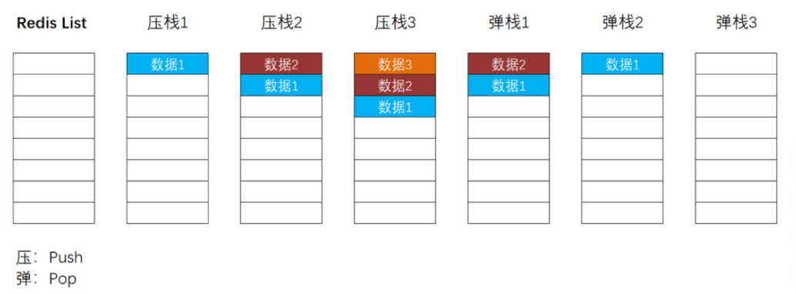
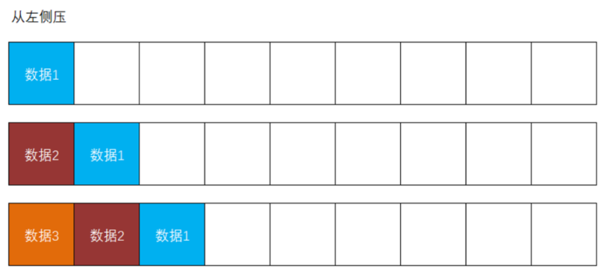
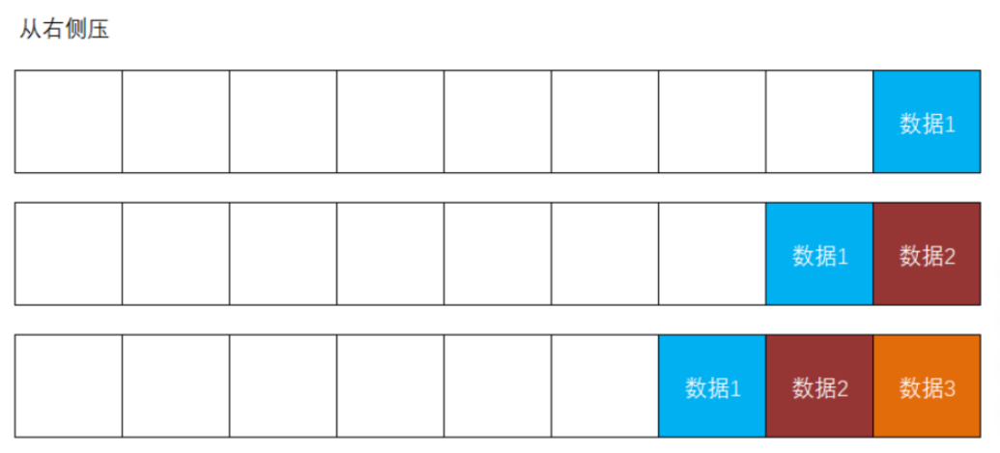
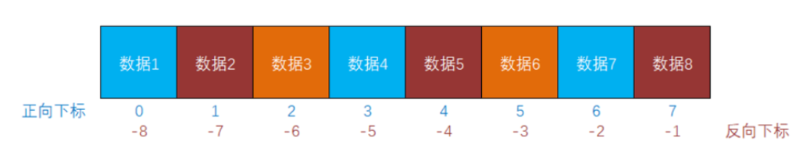

# 处理省市区的数据

由于省市区的数据是几乎不会修改的数据（或：理解为修改频率非常低），所以，这些数据适合放在Redis中，要实现这样的处理，大致需要：

- 从MySQL中读取

- 向Redis中写入

- 后续，从Redis中读取

提示：省市区的数据通常是直接通过执行SQL脚本插入到数据表中的，所以，并不需要开发对应的写入功能！

关于省市区的数据，需要实现的功能主要有：

- 根据父级行政单位查询其子级行政单位（例如：根据某个省查询其下的所有市，或根据某个市查询其下所有的区）

本次，创建新的模块项目处理这些数据，则在`tmall-server`下创建`tmall-basic`子模块项目，此子模块项目与其它项目还有些不同之处：

- 不需要实现用户的认证与授权
  - 项目中不需要添加Spring Security的依赖项

当项目创建出来后，应该：

- 调整`pom.xml`
- 处理配置文件
- 添加必要的配置类

接下来，按照相对固定的开发流程进行处理即可！

关于Mapper层：

- 创建`DistrictSimplePO`类（创建在`tmall-common`中）：`id` / `code` / `name(name + suffix)` / `pinyin`

- 创建`DistrictMapper`接口，在接口中添加抽象方法：

  ```java
  List<DistrictSimplePO> listByParent(Long parentId);
  ```

- 创建`DistrictMapper.xml`，配置以上抽象方法映射的SQL语句，需要执行的SQL语句大致是：

  ```mysql
  SELECT 
  	id, code, concat(name, suffix) AS name, pinyin
  FROM
  	dict_district
  WHERE
  	parent_id=?
  ORDER BY
  	sort
  ```

- 测试

关于Repository层：

- 创建接口（抽象方法与Mapper的完全相同）及实现类，实现类中直接调用Mapper实现查询即可

关于Service层：

- 创建接口（抽象方法与Repository的完全相同）及实现类，实现类中直接调用Repository实现查询即可

关于Controller层

- 直接调用Service的查询方法，并将结果响应到客户端即可

# 关于Redis中的list类型

Redis中的`list`类型是用于存储有序列表的，在Redis的内存中，`list`是一种先进后出、后进先出的栈结构的数据，在栈结构中，存入数据的操作称之为“压栈（push）”，取出数据的操作称之为“弹栈（pop）”：



在学习Redis中的`list`时，你应该将Redis的栈结构水平旋转90度来理解！

在操作Redis中的`list`数据时，可以从左侧压栈，也可以从右侧压栈，例如：





当读取Redis中的`list`数据时，**始终从左至右读取数据！**通常，为了符合绝大部分开发者的使用习惯，会采取**从右侧压栈**的操作！

在Redis的`list`数据中，每个元素都有2种下标，分别是从左至右、从0开始顺序递增的下标，和从右至左、从-1开始顺序递减的下标，例如：



注意：当读取Redis中的`list`数据的区间段时，必须保证`start`元素在`end`元素的左侧！

# 关于向Redis中写入数据

**策略：**当尝试获取数据时，直接从Redis中获取，如果Redis中没有所需的数据，则从MySQL中查询并写入到Redis中即可。

**问题：**

- 首次获取数据时较慢（需要先从MySQL中查询并向Redis中写入）
  - 如果“首次获取数据”发生在服务器压力较大时，后果更加严重
- 如果获取的数据在Redis中不存在，在MySQL中也不存在，则可能导致缓存穿透问题！

**策略：**当服务器启动时，就将所有需要的数据全部写入到Redis中，后续，当需要获取数据时，始终从Redis中查找，即便Redis中没有所需的数据，也将直接返回“无”的结果，并不会从MySQL中查找。

**问题：**

- 数据量大时，可能导致启动过程耗时较长
  - 通常，不介意

# 关于缓存预热

缓存预热：：当服务器启动时，就将所有需要的数据全部写入到Redis中。

在Spring Boot中，可以自定义组件类，实现`ApplicationRunner`接口，此接口中的方法就是启动项目时会自动调用的方法！

# 关于缓存穿透

当使用“如果Redis中无数据就从MySQL中查询并写入到Redis”的策略时，如果反复使用Redis和MySQL中都没有的数据参数提交查询，则会始终查询到MySQL，这样的查询越来越多后，MySQL的压力就会越来越大，最终可能导致服务器崩溃！

常见的解决方案有：

- 更换策略，例如：从Redis中查询，如果Redis中没有满足条件的数据，也直接返回，根本不查询MySQL
- 如果Redis中没有满足条件的数据，则从MySQL中查询，如果MySQL中也没有满足条件的数据，会向Redis中存入一个空数据（不是`null`），后续，从Redis中查询时，即便存在空数据，也直接返回，而不会查询MySQL
  - 为了避免数据长期不准确，可以给空数据设置一个有效期
- 布隆过滤器（再议）


