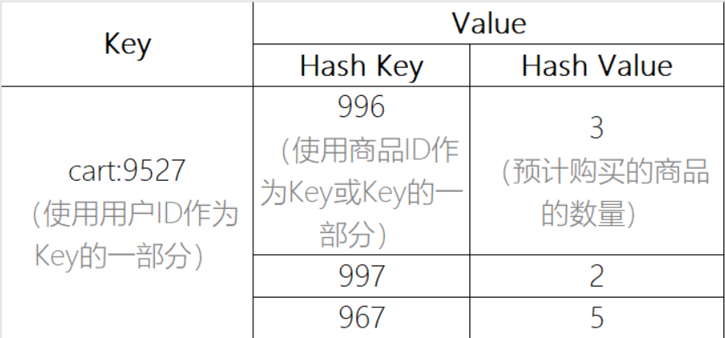

# 请参考`tmall-server-repo`开发必要功能

- 【tmall-front-mall】添加收货地址
  - 在业务中，应该判断省与市，但不判断区
  - 在业务中，如果新增的收货地址是“默认的”，需要先将原本“默认的”改为“非默认”
- 【tmall-front-mall】查询用户的收货地址列表
- 【tmall-front-mall】根据ID查询收货地址
  - 确保用户只能查到自己的收货地址，不能查别人的收货地址

# 关于购物车

购物车在电商平台中，是一种过渡的临时数据，没有永久保存的价值，所以，在数据库，并不需要（注意：不是不能）设计购物车的数据表！

通常，可以把购物车的数据保存在Redis中，因为Redis的定义就是“缓存”数据，并且，Redis会自动的将内存中的数据同步到硬盘，即使重启也不会丢失数据，所以更适合存储购物车数据！

**注意：**使用Redis保存购物车中的数据时，不建议使用Redis中的`list`类型，因为购物车存储商品信息时，还要存储预计购买的数量，这个数量是可能需要修改的，而`list`中的元素并不易于实现修改！

建议使用Redis中的`hash`类型存储购物车数据，因为`hash`是最适合修改数据的某个部分的值的数据类型，使用时数据结构大致如下：

关于购物车中的功能开发：

- 添加商品到购物车
- 删除购物车中的商品
- 将购物车中商品的数量增加1
- 增加购物车中商品的数量（通过请求参数指定增加的数量）
- 将购物车中商品的数量减少1
- 减少购物车中商品的数量（通过请求参数指定减少的数量）
- 查询购物车列表

关于订单的功能开发：

- 创建订单
  - 向订单表（`mall_order`）中插入数据
  - 向订单商品表（`mall_order_item`）中插入数据
  - 删除Redis中对应的购物车数据

