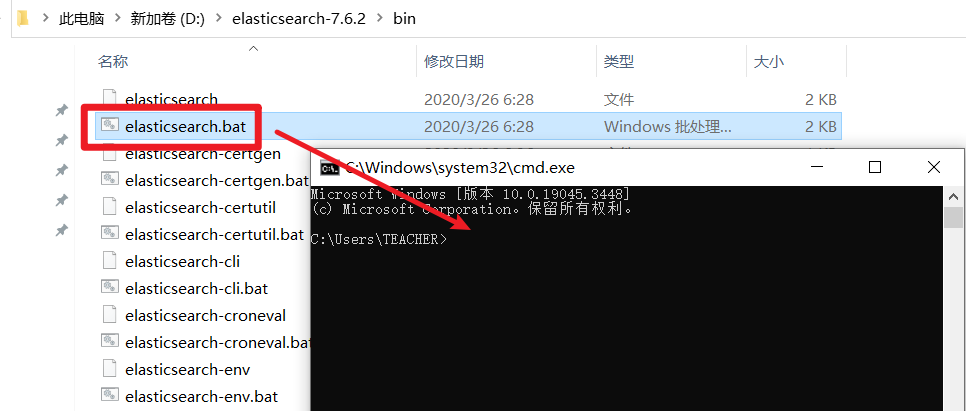
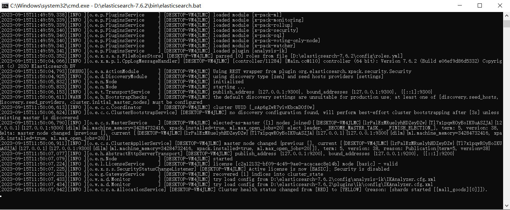
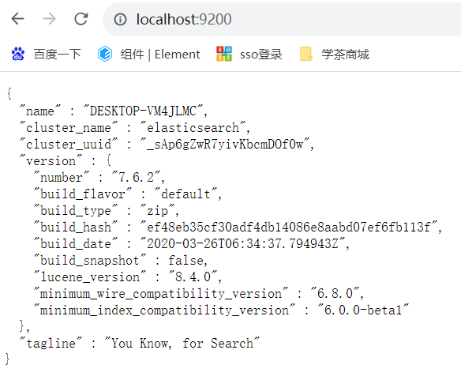

# 关系型数据库中的索引

索引：在关系型数据库中，索引（index）是一种单独的、物理层面对数据表中的1列或多列的值进行排序检索的数据结构。

当表中的数据越来越多，查询时，耗时就会越来越久！之所以出现这样的现象，是因为数据库在执行查询时，会遍历表中的每一条数据，并且与SQL语句中的查询条件进行对比，判断是否符合查询条件，如果符合，则列入到查询结果集中！

另外，关系型数据库都是基于磁盘存储的，磁盘的读写效率本身就非常低下，而且各数据并不是整齐的排列在磁盘上的，而是散列的分布在磁盘的不同位置，所以，磁盘的IO操作本身也非常耗时！

在MySQL中，创建索引的SQL语法是：

```mysql
CREATE INDEX index_name ON table_name (field_name[, field_name_2, ... field_name_n]);
```

例如：

```mysql
CREATE INDEX idx_title ON mall_goods (title);
```

注意：

- 如果表中已经存在数据，创建索引的耗时可能较长
- 针对某张表的某个字段，创建索引是一次性的行为，并不需要反复创建

当成功创建索引后，索引对应的字段的查询将可以在毫秒级完成！

删除索引的语法是：

```mysql
DROP INDEX index_name ON table_name;
```

例如：

```mysql
DROP INDEX idx_title ON mall_goods;
```

在创建索引时，MySQL会先将对应的字段的数据进行排序，并且，在索引中记录下每条数据的位置信息，所以，索引相当于“书的目录”，后续，当需要根据这个字段查询数据时，会先“翻书的目录”，并直接翻到对应的“那一页”，就可以找出所需的数据，则整体效率非常之高！

索引的本质是一种B+Tree结构（是一种树型结构）的数据，在MySQL中，InnoDB存储引擎中的页的大小是16KB，如果在索引中存储的数据是使用BIGINT类型作为主键，则每个主键需要占用8字节，在B+Tree中的指针占用4~8字节，每个指针与主键将形成B+Tree中的1个节点，则每个节点最多占用16字节，每页最少可以存储1024个节点，则深度为3的B+Tree最少可以存储1024 x 1024 x 1024个节点，大约是1000 x 1000 x 1000 = 1000000000个节点（10亿），所以，每个B+Tree至少可以维护10亿个节点，如果表中的数据量不超过10亿条，都最只需要执行3次查找，就可以确定需要查询的数据的位置！

在数据库中，即使你没有显式的为某些字段创建索引，但是某些字段的查询效率也会非常高，是因为数据库中存在多种不同的索引，常见的有：

- PRIMARY KEY：主键索引
- UNIQUE：唯一索引
- INDEX：一般索引（普通索引）
- FULLTEXT：全文索引

基于索引的特点，必须注意：

- 索引不会包含为NULL值的列
- 数据量非常少的表没有必要创建索引，例如大部分字典表
- 数据经常发生变化（被修改的频率较高）的表，不要创建索引，因为数据变化时，很有可能需要更新索引，导致整体更新效率低下
- 查询时需要计算字段时，索引是无效的，例如：`where age + #{param1} > #{param2}`，则`age`字段的索引是无效的
- 左侧的模糊查询无法使用索引，因为索引是基于对这一列的数据进行排序得到的

除了以上限制以外，不同的企业的开发规范可能提出其它更多要求：

- 在 varchar 字段上建立索引时，必须指定索引长度，没必要对全字段建立索引，根据实际文本区分度决定索引长度即可

# 关于Elasticsearch

Elasticsearch是专门用于解决搜索问题的非关系型文档数据库。

在使用时，你需要下载Elasticsearch：

- Windows：https://mirrors.huaweicloud.com/elasticsearch/7.6.2/elasticsearch-7.6.2-windows-x86_64.zip
- Mac OS：https://mirrors.huaweicloud.com/elasticsearch/7.6.2/elasticsearch-7.6.2-darwin-x86_64.tar.gz
- Linux：https://mirrors.huaweicloud.com/elasticsearch/7.6.2/elasticsearch-7.6.2-x86_64.rpm

另外，还需要下载（以下3个链接选择其中1个下载即可）：

- https://github.com/medcl/elasticsearch-analysis-ik/releases/download/v7.6.2/elasticsearch-analysis-ik-7.6.2.zip
- https://robinliu.3322.org:8888/download/elasticsearch-analysis-ik-7.6.2.zip
- https://pan.baidu.com/s/1m807c0mGvKuHya_uDFxh3Q （提取码：zz2f）

当下载完成后，你可以把Elasticsearch文件夹放在任何你找得到的地方，但是，需要保证：

- 此文件夹有完整的访问权限
- 文件夹的路径中**必须不包含**中文、空格、特殊的标点符号

另外，如果后续无法正常启动，可能你需要在操作系统的环境变量中配置`JAVA_HOME`，例如：


当你不确定是否可以正确启动Elasticsearch时，你应该先打开CMD窗口，然后，将Elasticsearch文件夹下的`bin`文件夹下的`elasticsearch.bat`拖到CMD窗口中执行，例如：



当启动完成后（窗口中不再出现新的信息，并且没有明确的错误），大致效果如下：



此时，你可以打开浏览器，访问 http://localhost:9200，如果可以正常访问，则表示Elasticsearch已经成功启动：



当需要关闭时，直接关闭CMD窗口即可。

注意：当没有在操作系统中注册Elasticsearch服务时，每次开机都需要自己手动启动Elasticsearch。

# 【其它】模拟面试的典型问题

**1. 关于自我介绍**

基本情况简洁即可，不谈劣势

不谈过于基础的能力

谈项目的时候，对项目进行大概介绍（简洁），及负责的开发任务

**2. 英语**

常用的要会说，并且，发音不要太大偏差

**3. 表达**

注意语速，尽量保证流畅

**4. 表情**

不要长时间望天，不要长时间闭眼

**5. 逻辑性**

不要张口就来，先想，再答

**6. 应用**

关于知识点的题目，尽量回答应用场景

**7. 扩展**

只要会做1个，大胆的扩展出更多个

**8. 重逻辑，轻代码**

描述项目中的功能实现时，注重描述实现的逻辑、流程、注意事项等思路的相关问题，并且，保证逻辑的合理性，可以不必关注代码的实现


```
#{}：预编译：先（词法分析，语义分析）编译，再把参数值代入执行），防SQL注入，所有值不需要考虑单引号的问题，但是，只能表示某个值

where username=?

-------------------------------------------------------------------------------------

${}：非预编译：（先将值代入，再（词法分析，语义分析）编译，再执行），存在SQL注入的风险，非数值和非布尔值需要考虑单引号的问题，但是，可以表示SQL语句中的任何片段

                xxx' or 'a'='a
where username='#{xxx}'
      username='xxx' or 'a'='a'
      
      
select * from user where username='${username}'

                         username='root'
                         id=1
select * from user where ${whereClause}

       * from user where id=1
select ${xxx}
```


