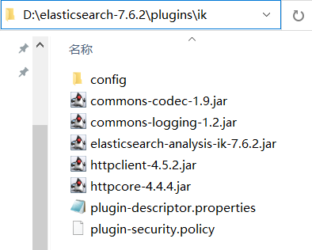
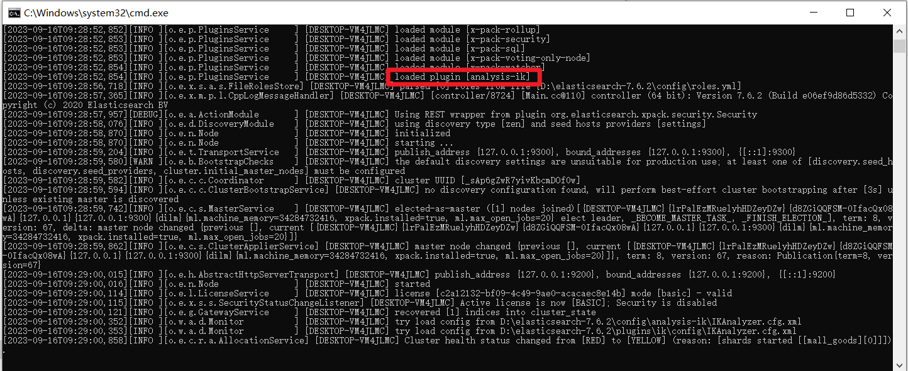
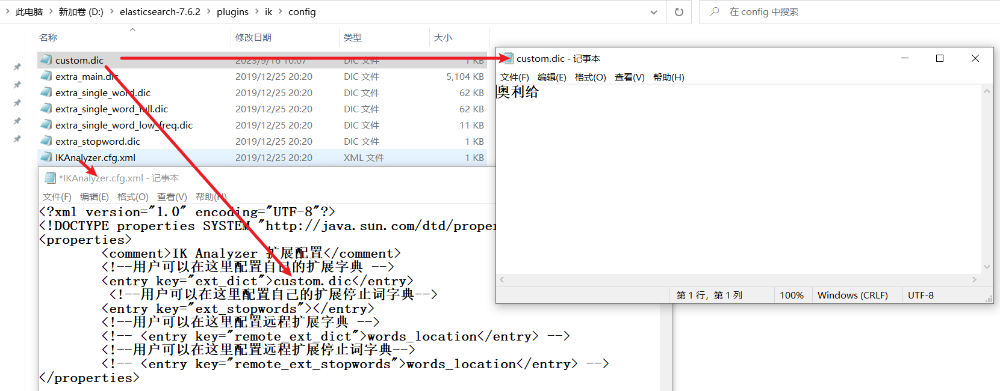

# 使用HTTP Request访问Elasticsearch

在HTTP Request中，发送请求的代码大致是：

```
### 测试访问Elasticsearch
GET http://localhost:9200
```

提示：在同一个源文件中可以编写多个请求，但多个请求之间必须使用`###`的一行作为分隔，所以，通常直接使用`###`开头来编写某行注释！

当需要携带请求的参数时，必须在请求下方先配置请求参数的文档类型，然后，添加1行空白，再编写请求参数，例如：

```
### 简单的分词
GET http://localhost:9200/_analyze
Content-Type: application/json

{
  "text": "nice to meet you."
}
```

# 关于Elasticsearch中的分词

默认情况下，Elasticsearch无法对中文的句子进行正确的分词，它只能将一句话中的各个汉字逐一拆开，无法识别其中的词语！

为了实现对中文的正确分词，需要在Elasticsearch中添加`IK`分词器插件！

你应该在Elasticsearch所在的文件夹下的`plugins`文件夹下创建新的文件夹，例如名为`ik`的文件夹，然后，将下载得到的IK分词器压缩包中的文件全部解压到`ik`文件夹下，例如：



完成后，你需要重启Elasticsearch才可以应用IK分词器！你可以在启动日志中看到它：



接下来，你可以使用IK分词器对中文的句子进行分词！

在IK分词器中，提供了2种分词方式，分别是`ik_smart`和`ik_max_word`，使用示例如下：

```
### 中文分词：ik_smart（智能）
GET http://localhost:9200/_analyze
Content-Type: application/json

{
  "analyzer": "ik_smart",
  "text": "今天的天气真不错！"
}

### 中文分词：ik_max_word（最大词量，也称之最细粒度）
GET http://localhost:9200/_analyze
Content-Type: application/json

{
  "analyzer": "ik_max_word",
  "text": "今天的天气真不错！"
}
```

当使用`ik_smart`时，分词结果为：`今天`，`的`，`天气`，`真不错`。

当使用`ik_max_word`时，分词结果为：`今天`，`的`，`天气`，`真不错`，`真不`，`不错`。

如果IK分词器无法对某些词进行正确的分词时（特别是某些时兴的新词），可以自造词：



# 关于Elasticsearch的相关概念

- **索引**（index / indices）
  - 相当于MySQL中的Database

- **类型**（type / types）
  - 相当于MySQL中的Table
  - 在更加新的版本（例如8.x版本）中，已经淡化此概念
  - 你可以按需创建“类型”，或，如果不关心“类型”，可以使用`_doc`作为类型名
    - 通常不需要创建类型
- **文档**（document / documents）
  - 相当于MySQL中一行行的数据，在Elasticsearch中这些数据都表现为JSON格式
- **字段**（field / fields）
  - 相当于MySQL中的Field / Column

# 使用Elasticsearch访问数据

## 添加数据

### 添加文档（分配随机ID值）

请求URL的格式：

```
POST http://localhost:9200/{索引名}/{类型名}
```

提示：当添加文档时，如果索引尚不存在，会自动创建，如果类型不存在，会自动创建

注意：使用这种方式添加的文档会被分配随机的ID值，后续，当需要查找到此数据时，需要使用到被分配的ID值

示例：

```
### 添加文档
POST http://localhost:9200/index_curd/_doc
Content-Type: application/json

{
  "id": 1,
  "username": "root",
  "password": "123456",
  "enable": 1
}
```

### 添加文档（自定义ID值）

请求URL的格式：

```
PUT http://localhost:9200/{索引名}/{类型名}/{文档ID}
```

示例：

```
### 添加文档（自定义ID值）
PUT http://localhost:9200/index_curd/_doc/9527
Content-Type: application/json

{
  "username": "lisi",
  "password": "123456",
  "enable": 0
}
```

## 查看文档

### 查看某个索引中的所有文档

请求URL的格式：

```
GET http://localhost:9200/{索引名}/_search
```

示例：

```
GET http://localhost:9200/{索引名}/_search
```

### 根据ID查看文档

请求URL的格式：

```
GET http://localhost:9200/{索引名}/{类型名}/{文档ID}
```

示例：

```
### 根据ID查看文档
GET http://localhost:9200/index_curd/_doc/9528
```

## 修改文档

### 修改整篇文档

请求URL的格式：

```
PUT http://localhost:9200/{索引名}/{类型名}/{文档ID}
```

注意：提交的参数会覆盖原有的整篇文档，例如，原文档有8个属性，参数只有2个属性，修改成功后，此文档只有参数对应的2个属性

示例：

```
### 根据ID修改整篇文档
PUT http://localhost:9200/index_curd/_doc/9527
Content-Type: application/json

{
  "password": "888888"
}
```

### 修改文档中的部分字段的值

请求URL的格式：

```
POST http://localhost:9200/{索引名}/{类型名}/{文档ID}/_update
```

另外，本次提交的参数的格式必须是：

```json
{
    "doc": {
        // 新数据的字段名与值，例如："password": "88888"
    }
}
```

注意：修改时传入的参数，不必是原本就有的字段，修改参数可以包含新的字段与值，当修改成功后，原数据会增加新的字段！

示例：

```
### 修改文档中的部分字段的值
POST http://localhost:9200/index_curd/_doc/9527/_update
Content-Type: application/json

{
  "doc": {
    "password": "lisi888",
    "nickname": "小李同学"
  }
}
```

## 删除

### 根据ID删除文档

请求URL的格式：

```
DELETE http://localhost:9200/{索引名}/{类型名}/{文档ID}
```

示例：

```
### 根据ID删除文档
DELETE http://localhost:9200/index_curd/_doc/9527
```

### 删除索引

请求URL的格式：

```
DELETE http://localhost:9200/{索引名}
```

示例：

```
### 删除索引
DELETE http://localhost:9200/index_curd
```

# Elasticsearch中的字段的数据类型

在Elasticsearch中，文档的各个字段都是有数据类型的，大致有：

- 字符串类型：`text / keyword`
  - 当类型为`text`时，默认会被分词，当类型为`keyword`时，不会被分词
  - 默认的类型是`text`
- 数值类型：`byte / short / integer / long / float / double`等 
- 布尔类型
- 日期类型
- 二进制类型
- 其它（可参考 org.springframework.data.elasticsearch.annotations.FieldType 枚举类型）

在索引刚刚创建出来时，在还没有写入任何文档之前，应该自行设计各字段的数据类型！

- 如果直接写入文档，会自动根据写入数据来确定各字段的数据类型

创建索引并设计字段的请求格式为：

```
PUT http://localhost:9200/{索引名}
Content-Type: application/json

{
	"mappings": {
		"properties": {
			"{字段名1}": {
				"type": "{数据类型1}"
        	},
			"{字段名2}": {
				"type": "{数据类型2}"
        	},
        	... ...
			"{字段名n}": {
				"type": "{数据类型n}"
        	}
        }
	}
}
```

示例：

```
PUT http://localhost:9200/index_search
Content-Type: application/json

{
	"mappings": {
		"properties": {
			"id": {
				"type": "long"
        	},
			"category": {
				"type": "keyword"
        	},
			"title": {
				"type": "text"
        	},
        	"brief": {
				"type": "text"
        	},
			"sort": {
				"type": "integer"
        	},
			"price": {
				"type": "integer"
        	}
        }
	}
}
```

# 使用Elasticsearch搜索数据

## 准备测试数据

| id   | category | title                                                        | brief                      | sort | price |
| ---- | -------- | ------------------------------------------------------------ | -------------------------- | ---- | ----- |
| 1    | 绿茶     | 2023年明前特级信阳毛尖绿茶 250克（125g*2罐）                 | 细、圆、紧、直 鲜爽持久    | 150  | 668   |
| 2    | 绿茶     | 2023年西湖龙井新茶 传统纸包 明前一级绿茶 200克               | 甄选清香、带豆花香         | 180  | 386   |
| 3    | 红茶     | 2023年经典58红茶 浓香型大叶种滇红茶 380克                    | 香甜醇爽 温润滑顺          | 120  | 579   |
| 4    | 红茶     | 2023年金骏眉武夷红茶 桐木村高山特级红茶 80克                 | 甘醇甜滑 滋味绵软 蜜薯香馥 | 110  | 866   |
| 5    | 茶具     | 陶瓷旅行茶具 便携式快客杯功夫茶具 一壶二杯（泡茶容量约170ml左右） | 一壶二杯 简约礼盒装        | 120  | 632   |

```
### 添加测试数据文档-1（自定义ID值）
PUT http://localhost:9200/index_search/_doc/1
Content-Type: application/json

{
  "id": 1,
  "category": "绿茶",
  "title": "2023年明前特级信阳毛尖绿茶 250克（125g*2罐）",
  "brief": "细、圆、紧、直 鲜爽持久",
  "sort": 150,
  "price": 668
}

### 添加测试数据文档-2（自定义ID值）
PUT http://localhost:9200/index_search/_doc/2
Content-Type: application/json

{
  "id": 2,
  "category": "绿茶",
  "title": "2023年西湖龙井新茶 传统纸包 明前一级绿茶 200克",
  "brief": "甄选清香、带豆花香",
  "sort": 180,
  "price": 386
}

### 添加测试数据文档-3（自定义ID值）
PUT http://localhost:9200/index_search/_doc/3
Content-Type: application/json

{
  "id": 3,
  "category": "红茶",
  "title": "2023年经典58红茶 浓香型大叶种滇红茶 380克",
  "brief": "香甜醇爽 温润滑顺",
  "sort": 120,
  "price": 579
}

### 添加测试数据文档-4（自定义ID值）
PUT http://localhost:9200/index_search/_doc/4
Content-Type: application/json

{
  "id": 4,
  "category": "红茶",
  "title": "2023年金骏眉武夷红茶 桐木村高山特级红茶 80克",
  "brief": "甘醇甜滑 滋味绵软 蜜薯香馥",
  "sort": 110,
  "price": 866
}

### 添加测试数据文档-5（自定义ID值）
PUT http://localhost:9200/index_search/_doc/5
Content-Type: application/json

{
  "id": 5,
  "category": "茶具",
  "title": "陶瓷旅行茶具 便携式快客杯功夫茶具 一壶二杯（泡茶容量约170ml左右）",
  "brief": "一壶二杯 简约礼盒装",
  "sort": 120,
  "price": 632
}
```

## 简单搜索

请求URL的格式：

```
GET http://localhost:9200/{索引名}/_search/?q={字段名:关键词}
```

示例：

```
### 简单搜索
GET http://localhost:9200/index_search/_search?q=title:特级
```

## 自定义搜索

### 指定条件的搜索（单一条件）

请求URL的格式：

```
GET http://localhost:9200/{索引名}/_search
Content-Type: application/json

{
	"query": {
		"match": {
			"{字段名}": "{关键词}"
		}
	}
}
```

以上格式中，`query`表示“查询条件”的相关配置，`match`表示“匹配”，也可以替换为`match_all: {}`表示搜索所有。

示例：

```
### 自定义搜索：单一条件
GET http://localhost:9200/index_search/_search
Content-Type: application/json

{
  "query": {
    "match": {
      "title": "绿茶"
    }
  }
}
```

### 指定条件的搜索（复合条件）

请求URL的格式：

```
GET http://localhost:9200/{索引名}/_search
Content-Type: application/json

{
	"query": {
		"bool": {
			"must": [
				{
					"match": {
						"{字段名1}": "{关键字}"
					}
				},
				{
					"match": {
						"{字段名2}": "{关键字}"
					}
				}
			]
		}
	}
}
```

以上格式中，`must`表示接下来的多个条件必须是`AND`的关系，也可以替换为`should`表示多个条件是`OR`的关系，或替换为`must_not`表示接下来的这个条件是“非”的关系。

示例：

```
### 指定条件的搜索：复合条件，其中，must >>> AND / should >>> OR / must_not >>> !=
GET http://localhost:9200/index_search/_search
Content-Type: application/json

{
  "query": {
    "bool": {
      "should": [
        {
          "match": {
            "title": "绿茶"
          }
        },
        {
          "match": {
            "brief": "清香"
          }
        }
      ]
    }
  }
}
```

### 指定搜索结果的字段列表

请求URL的格式：

```
GET http://localhost:9200/{索引名}/_search
Content-Type: application/json

{
	"query": { 参考前序案例 },
	"_source": [
		"{字段名1}", "{字段名2}", ..., "{字段名n}"
	]
}
```

注意：如果没有配置`_source`，或配置的`_source`中没有数组元素，将视为查询所有字段，另外，如果存在错误的字段名，也不会导致搜索出错！

示例：

```
### 指定搜索结果的字段列表
GET http://localhost:9200/index_search/_search
Content-Type: application/json

{
  "query": {
    "match_all": {}
  },
  "_source": [
    "title",
    "price"
  ]
}
```

### 指定搜索结果的排序规则

请求URL的格式：

```
GET http://localhost:9200/{索引名}/_search
Content-Type: application/json

{
	"query": { 参考前序案例 },
	"sort": [
		{
			"字段名": {
				"order": "{排序规则}"
			}
		}
	]
}
```

示例：

```
### 指定搜索结果的排序规则
GET http://localhost:9200/index_search/_search
Content-Type: application/json

{
  "query": {
    "match_all": {}
  },
  "sort": [
    {
      "sort": {
        "order": "desc"
      }
    },
    {
      "price": {
        "order": "desc"
      }
    }
  ]
}
```

### 对搜索结果进行分页

请求URL的格式：

```
GET http://localhost:9200/{索引名}/_search
Content-Type: application/json

{
	"query": { 参考前序案例 },
	"from": 值,
	"size": 值
}
```

示例：

```
### 对搜索结果进行分页
GET http://localhost:9200/index_search/_search
Content-Type: application/json

{
  "query": {
    "match_all": {}
  },
  "from": 2,
  "size": 2
}
```

### 在搜索结果中高亮显示关键字

请求URL的格式：

```
GET http://localhost:9200/{索引名}/_search
Content-Type: application/json

{
	"query": { 参考前序案例 },
	"highlight": {
		"fields": {
			"{字段名}": {}
		},
		"pre_tags": "<font style='color: red;'>",
		"post_tags": "</font>"
	}
}
```

示例：

```
### 在搜索结果中高亮显示关键字
GET http://localhost:9200/index_search/_search
Content-Type: application/json

{
  "query": {
    "match": {
      "title": "绿茶"
    }
  },
  "highlight": {
    "fields": {
      "title": {}
    },
    "pre_tags": "<font style='color: red;'>",
    "post_tags": "</font>"
  }
}
```

# 基于Spring Boot的Elasticsearch编程

## 添加依赖

```xml
<!-- Spring Boot支持Elasticsearch编程的依赖项-->
<dependency>
    <groupId>org.springframework.boot</groupId>
    <artifactId>spring-boot-starter-data-elasticsearch</artifactId>
</dependency>
```

## 创建Elasticsearch中的文档对应的数据类型

通常，需要存入到Elasticsearch中的数据属性包括：

- 需要被搜索的数据，以商品数据为例：商品的标题、简介、关键词列表
- 会显示在搜索结果中的数据，以商品数据为例：商品的标题、图片、价格
- 具有功能性效果的数据，以商品数据为例：商品的ID（用于页面跳转）、上架状态

并且，与文档对应的数据类型可能用于多个模块项目中（例如：在后台管理中将数据写入到ES，在前台从ES中搜索），所以，通常会把这些数据类型创建到`common`模块中。

在编写这样的类时，需要使用到几个注解：

- `@Document`：添加在类上，通过此注解的`indexName`配置此数据类型对应Elasticsearch中的哪个索引
- `@Id`：添加在属性上，表示此属性就是文档在Elasticsearch中的ID
- `@Field`：添加在非主键的属性上，此注解并不是必须的，主要用于配置此属性在Elasticsearch中的数据类型

则在`tmall-common`的根包下创建`pojo.po.GoodsSearchPO`类：

```java
package cn.tedu.tmall.common.pojo.po;

import lombok.Data;
import org.springframework.data.annotation.Id;
import org.springframework.data.elasticsearch.annotations.Document;
import org.springframework.data.elasticsearch.annotations.Field;
import org.springframework.data.elasticsearch.annotations.FieldType;

import java.io.Serializable;
import java.math.BigDecimal;
import java.time.LocalDateTime;

@Data
@Document(indexName = "mall_goods")
public class GoodsSearchPO implements Serializable {

    /**
     * 数据ID
     */
    @Id
    private Long id;

    /**
     * 类别ID
     */
    private Long categoryId;

    /**
     * 类别名称
     */
    @Field(type = FieldType.Keyword)
    private String categoryName;

    /**
     * 条形码
     */
    @Field(type = FieldType.Keyword)
    private String barCode;

    /**
     * 标题
     */
    @Field(type = FieldType.Text, analyzer = "ik_max_word", searchAnalyzer = "ik_max_word")
    private String title;

    /**
     * 摘要
     */
    @Field(type = FieldType.Text, analyzer = "ik_max_word", searchAnalyzer = "ik_max_word")
    private String brief;

    /**
     * 封面图
     */
    private String coverUrl;

    /**
     * 售价
     */
    private BigDecimal salePrice;

    /**
     * 关键词列表
     */
    @Field(type = FieldType.Text, analyzer = "ik_smart", searchAnalyzer = "ik_smart")
    private String keywords;

    /**
     * 排序序号
     */
    private Integer sort;

    /**
     * 是否推荐
     */
    private Integer isRecommend;

    /**
     * 上架状态，0=下架，1=上架
     */
    private Integer isPutOn;

    /**
     * 销量
     */
    private Integer salesCount;

    /**
     * 评论数量
     */
    private Integer commentCount;

    /**
     * 好评数量
     */
    private Integer positiveCommentCount;

    /**
     * 数据创建时间
     */
    private LocalDateTime gmtCreate;

    /**
     * 数据最后修改时间
     */
    private LocalDateTime gmtModified;

}
```

当需要读写Elasticsearch中的数据时，只需要自定义接口，添加`@Repository`注解，继承自`CrudRepository`接口，即可实现基本的数据读写！

```java
package cn.tedu.tmall.admin.mall.dao.search;

import cn.tedu.tmall.common.pojo.po.GoodsSearchPO;
import org.springframework.data.repository.CrudRepository;
import org.springframework.stereotype.Repository;

@Repository
public interface GoodsElasticsearchRepository
        extends CrudRepository<GoodsSearchPO, Long> {
}
```

测试：

```java
package cn.tedu.tmall.admin.mall.dao.search;

import cn.tedu.tmall.common.pojo.po.GoodsSearchPO;
import org.junit.jupiter.api.Test;
import org.springframework.beans.factory.annotation.Autowired;
import org.springframework.boot.test.context.SpringBootTest;

@SpringBootTest
public class GoodsElasticsearchRepositoryTests {

    @Autowired
    GoodsElasticsearchRepository repository;

    @Test
    void save() {
        GoodsSearchPO goodsSearchPO = new GoodsSearchPO();
        goodsSearchPO.setId(997L);
        goodsSearchPO.setCategoryName("绿茶");
        goodsSearchPO.setTitle("2023年明前特级信阳毛尖绿茶 250克（125g*2罐）");

        repository.save(goodsSearchPO);
    }

}
```

```
### 查看索引的基本状态
GET http://localhost:9200/mall_goods

### 查看数据
GET http://localhost:9200/mall_goods/_doc/997
```


